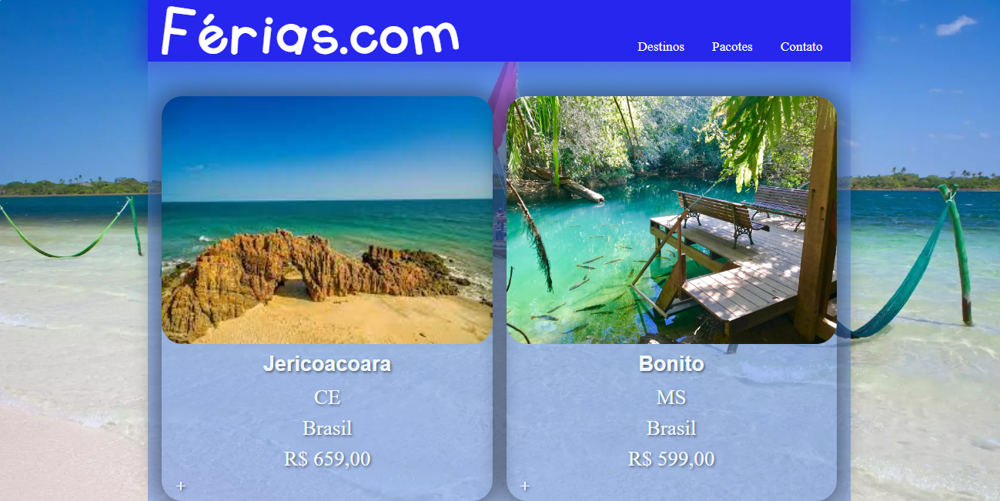
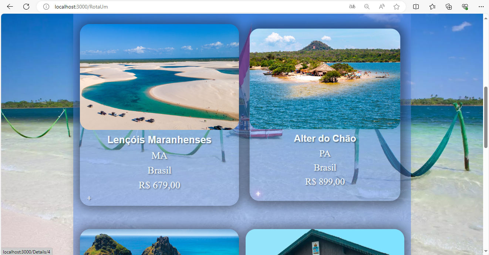

# Sobre o projeto

É uma aplicação web API em C# para consumir os dados de uma agencia de viagens ( Somente consulta a base de dados GET ), usando tecnologias web DOT NET. 

O projeto foi construído durante o curso de Desenvolvedor Full Stack da Recode Pro. 

## Layout web

# Tecnologias utilizadas
## Back end
- C#
## Front end
- Next.Js

